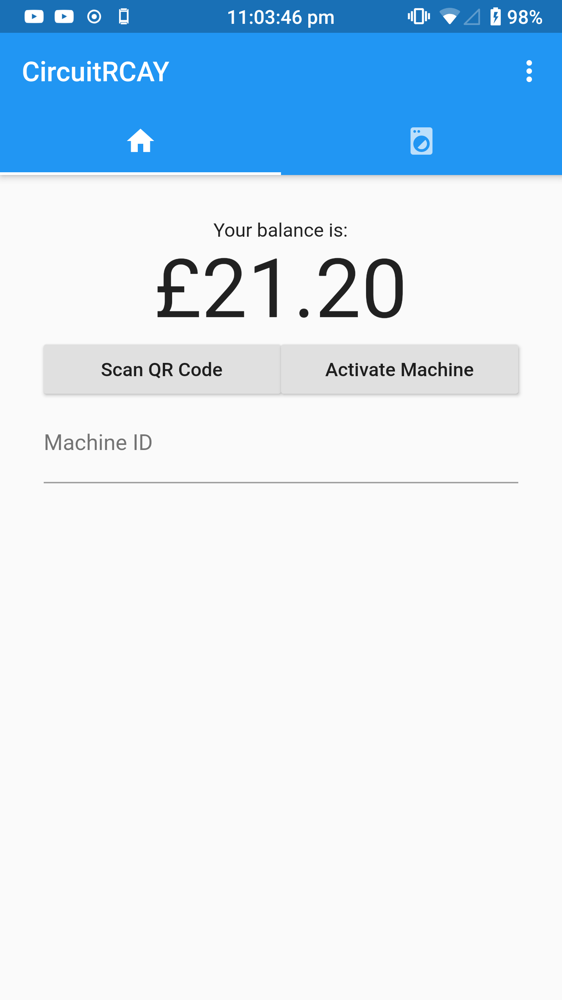
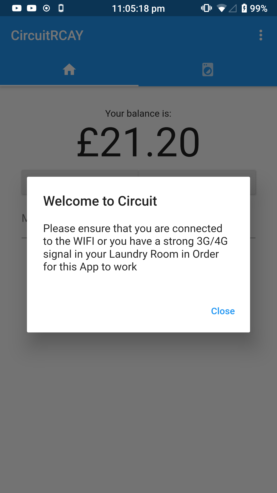

# circuitrcay
A Flutter project designed to replace CircuitRCAY.

## Incomplete
- [x] View your Balance
- [x] Activate Machines
- [x] View your organisation's message
- [x] QR code scanner
- [x] List of machines
- [ ] Notifications

For something that "barely" works, try [CircuitRCAY](https://github.com/7coil/circuitrcay).

## Image

